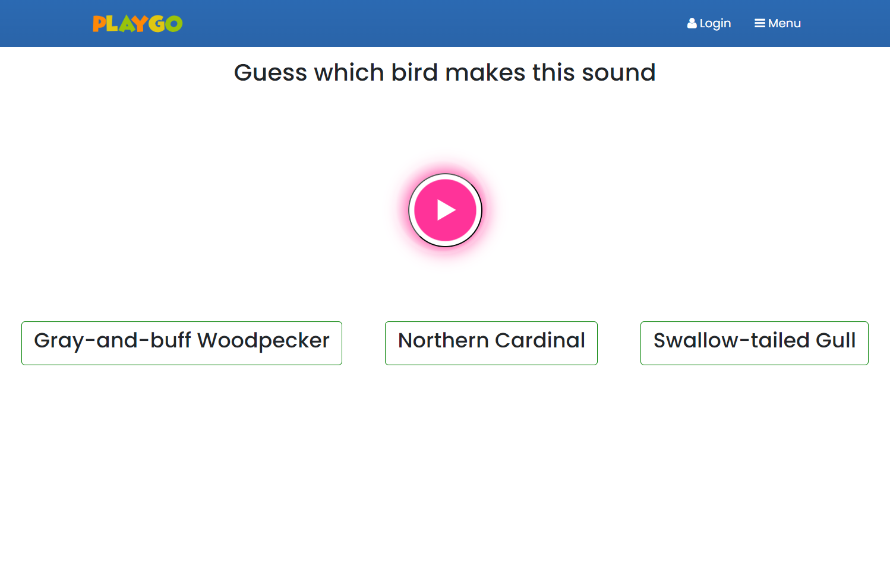

# Project Title
Playground

## Overview

Offering study activities, worksheet customization and small games for kids under 10.

### Problem

I used to spend a lot of time to find a approperiate worksheet and activities for my daughter, but didn't find a website with all these functions, and most these kind of websites are full with ads and popups.

### User Profile

- Children play with small games and do activities in this app. 
- Parents can use the worksheet page to customize the worksheet they need and print or download it.

### Features

- login 
- games - At first I put a memory game in this app, it has 3 levels and 3 theme for choosing. And the score will be presented in real time. More small games will be added in the future.
- worksheet customization
  - Handwriting worksheet accept input, parents can input the words or letters they need.
  - Three math templates are provided. Each one support customazing number range and operator
- Activities -One bird guessing game is implemented. More activities will be added in the future.

## Implementation

### Tech Stack

- React
- JavaScript
- MySQL
- Express
- Client libraries: 
    - react
    - react-router
    - axios
- Server libraries:
    - knex
    - express
    - bcrypt for password hashing

### APIs

### Sitemap

- Home page
  - SignIn
  - LogIn
  - Profile
- Game page
  - Memory game
- Worksheet page
  - Handwriting worksheet
  - Math worksheet template1
  - Math worksheet template2
  - Math worksheet template3
- Activity page

### Mockups

#### Home Page

#### Game Pages

#### Worksheet Pages

#### Activity Pages

### Data

### Endpoints

- **POST /auth/signup**
- **POST /auth/signin**
- **GET /profile**
- **PUT /profile**

### Auth
- JWT auth

## Roadmap

- Create client
    - react project with routes and boilerplate pages

- Create server
    - express project with routing, with placeholder 200 responses

- Create migrations

- Create seeds with sample user data

- Deploy client and server projects so all commits will be reflected in production

- Feature: Home page

- Feature: Create account
    - Implement register page + form
    - Create POST /users/register endpoint

- Feature: Login
    - Implement login page + form
    - Create POST /users/login endpoint

- Feature: Implement JWT tokens
    - Server: Update expected requests / responses on protected endpoints
    - Client: Store JWT in local storage, include JWT on axios calls

- Bug fixes

- DEMO DAY

## Nice-to-haves
- time lock - the screen will be locked if the user play games or activities more than 15 minites. Parents can unlock it with password.
- Save game score and show the podium
- User save their customized worksheet, make it public and let others to view, likes and download
- activities -science activity, math activity, sight word activity and more 
