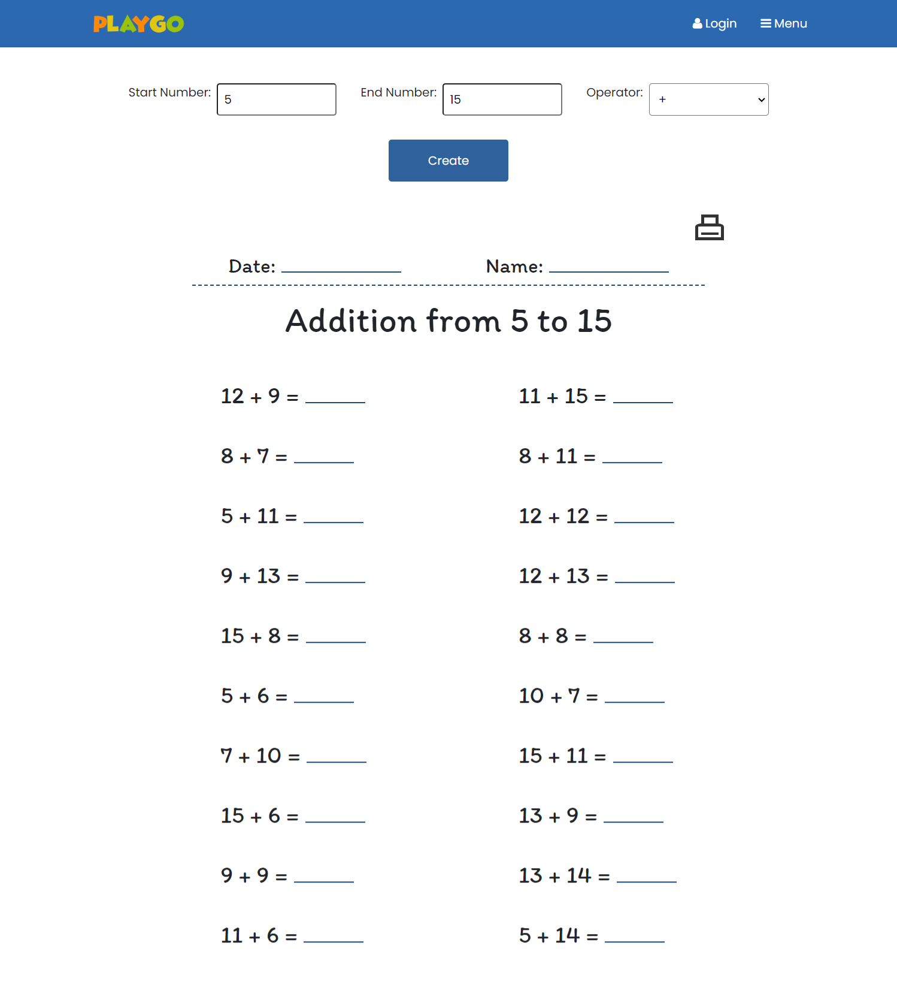

# Project Title
Playground

## Overview
I designed and implemented this web app for my daughter, who provided many design ideas. 
The app offers study activities, worksheet customization, and small games for children.

### Features

- signup/login 
- games - The app includes a memory game with three levels and three themes to choose from. Scores are displayed in real-time, and additional small games will be added in the future.
- worksheet generator
  - Handwriting worksheet allows parents to input custom words or letters, with adjustable font size and spacing.
  - Three math templates are provided, each customizable for number ranges and operators.
- Activities - Features a bird guessing game, with plans to add more activities in the future.
- Profile page - Logged-in users can view and modify their profile page.

### Tech Stack

- React
- TypeScript
- MySQL
- Express
- Client libraries: 
    - react
    - react-router
    - axios
    - lodash
    - Material UI
    - Bootstrap
- Server libraries:
    - knex
    - express
    - JWT
    - bcrypt for password hashing

### APIs
- **POST /auth/signup**
- **POST /auth/signin**
- **GET /profile**
- **PUT /profile**

### Sitemap

- Home page
  - SignUp
  - LogIn
  - Profile
- Game page
  - Memory game
- Worksheet page
  - Handwriting worksheet
  - Math worksheet template1
  - Math worksheet template2
  - Math worksheet template3
- Activity page

### Mockups

#### Home Page

#### Game Pages

#### Worksheet Pages

#### Activity Pages

### Data

### Auth
- JWT auth

## Future features
- time lock - the screen will be locked if the user play games or activities more than 15 minites. Parents can unlock it with password.
- Save game score and show the podium
- User save their customized worksheet, make it public and let others to view, likes and download
- activities -science activity, math activity, sight word activity and more 
